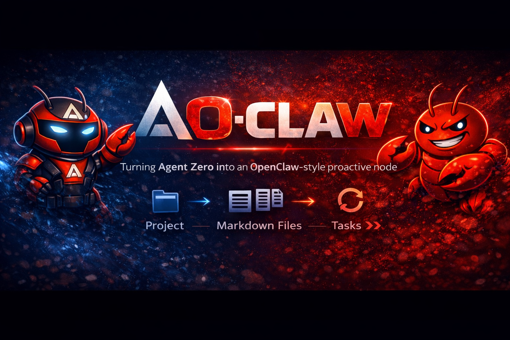
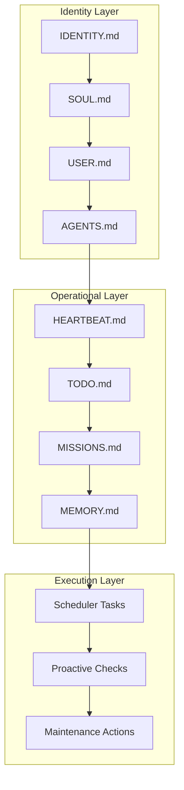
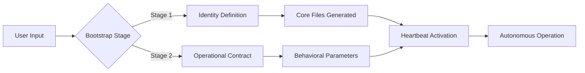
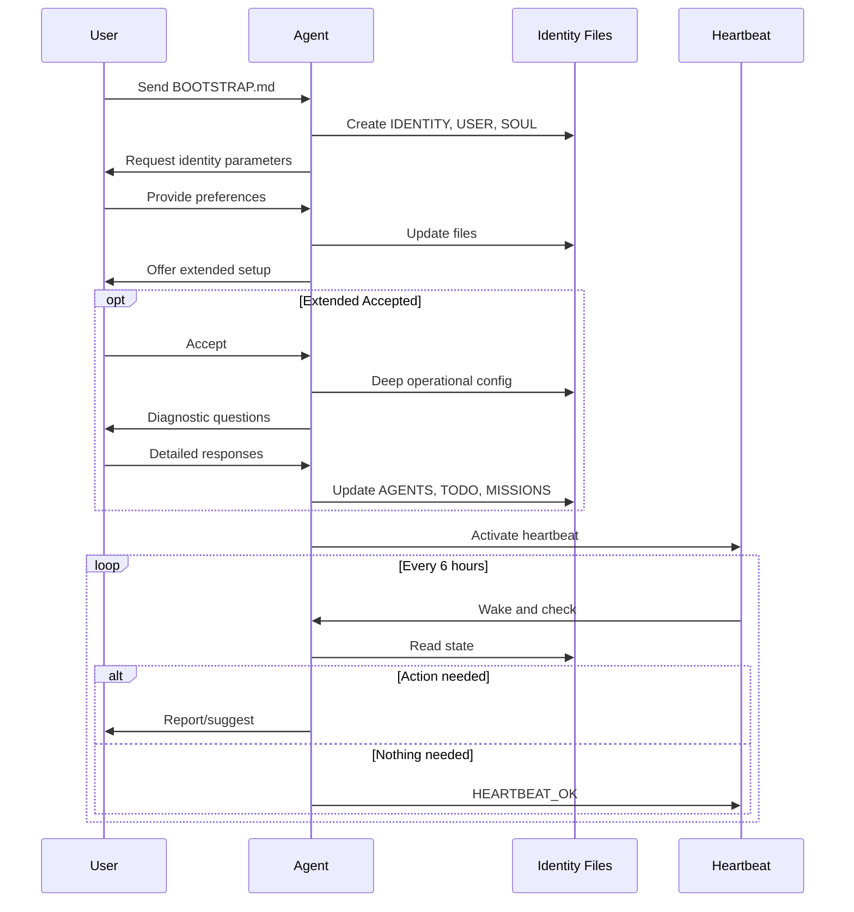

<div align="center">



# **A0-CLAW**
## *Enterprise-Grade Agent Identity & Orchestration System*

[](https://github.com/frdel/agent-zero)
[](https://openclaw.ai)
[](LICENSE)

**Transform Agent Zero into a proactive, identity-aware autonomous assistant**

</div>

---

## Executive Summary

A0-Claw brings enterprise-grade agent identity management to Agent Zero, implementing the OpenClaw protocol for persistent, proactive AI operations. This system creates a structured identity layer that survives session boundaries, enabling truly autonomous behavior with appropriate guardrails.



---

## Architecture

### System Overview



### File Structure Matrix

| Component | Purpose | Lifecycle |
|-----------|---------|-----------|
| **AGENTS.md** | Workspace configuration & startup routine | Persistent |
| **IDENTITY.md** | Core identity & behavioral defaults | Post-bootstrap |
| **SOUL.md** | Values, preferences & anti-patterns | Post-bootstrap |
| **USER.md** | User context & working preferences | Post-bootstrap |
| **HEARTBEAT.md** | Proactive check protocol | Persistent |
| **MEMORY.md** | Curated long-term memory | Evolving |
| **TODO.md** | Active task queue | Dynamic |
| **MISSIONS.md** | Strategic priorities | Dynamic |
| **TOOLS.md** | Operational reference | Static |

---

## Quick Start

### Prerequisites

- Agent Zero installed and operational
- Project workspace access

### Installation

```bash
# Clone or copy skill to Agent Zero skills directory
cp -r a0-claw /a0/skills/

# Initialize your agent
/a0/skills/a0-claw/scripts/init-agent.sh <agent-name> <timezone>

# Example:
/a0/skills/a0-claw/scripts/init-agent.sh aurora America/New_York
```

### Configuration

1. **Create Project**: In Agent Zero UI, create project matching your agent name
2. **Set Instructions**: Configure project instructions to reference workspace files
3. **Bootstrap**: Send `BOOTSTRAP.md` content as first message
4. **Extended Setup**: Upon completion, agent offers deep operational configuration
5. **Activate**: Configure heartbeat task for autonomous operation

---

## Two-Stage Bootstrap Protocol

### Stage 1: Identity Foundation

**Objective**: Establish core identity parameters

**Process**:
1. Send `BOOTSTRAP.md` as initial message
2. Agent initiates conversational discovery:
   - Name selection
   - Nature definition
   - Communication vibe
   - Signature emoji
3. Agent populates:
   - `IDENTITY.md`
   - `USER.md` (basic)
   - `SOUL.md` (basic)

**Completion Criteria**: Agent confirms identity establishment, deletes `BOOTSTRAP.md`

### Stage 2: Operational Contract (Optional)

**Objective**: Define working relationship parameters

**Process**:
1. Agent offers: *"Bootstrap complete. Continue to extended setup?"*
2. If accepted, deep diagnostic conversation covering:
   - Current project state & blockers
   - Communication preferences
   - Tool authorization matrix
   - Escalation protocols
   - Memory management strategy

**Completion Criteria**: Agent updates operational files with contextual parameters

---

## Implementation Guide

### Step 1: Project Initialization

```
Project Name: [agent-name]
Workspace: /a0/usr/projects/[agent-name]/
Working Directory: [configured in Agent Settings]
```

### Step 2: File Deployment

**Primary Location**: Project root (`/a0/usr/projects/[agent-name]/`)

**Runtime Injection**: Mirror to `.a0proj/instructions/` for automatic context loading

```bash
# Hybrid mirror deployment
cp /a0/usr/projects/[agent-name]/*.md /a0/usr/projects/[agent-name]/.a0proj/instructions/
```

### Step 3: Heartbeat Configuration

| Parameter | Value |
|-----------|-------|
| Task Type | Scheduled |
| Initial Schedule | `0 */6 * * *` (6-hour intervals) |
| Context | Dedicated |
| Attachments | HEARTBEAT.md, project root, instructions/ |

**System Prompt**:
```
Wake up [agent]. Read HEARTBEAT.md, MISSIONS.md, and TODO.md.
Perform small maintenance/progress actions.
If nothing needed, reply exactly: HEARTBEAT_OK
```

---

## Operational Capabilities

### Proactive Behavior
- **Heartbeat Protocol**: Scheduled wellness checks
- **Stale Item Detection**: Automatic identification of aging tasks
- **Maintenance Rotation**: Cyclic review patterns (TODO, MISSIONS, MEMORY)

### Safety Framework
- **External Action Gates**: Configurable authorization requirements
- **Destructive Operation Warnings**: Prevention protocols
- **Privacy Protection**: Data exposure prevention

### Memory Architecture
- **Daily Capture**: Automatic session logging
- **Curated Long-term**: Manual MEMORY.md management
- **Continuity Assurance**: File-based persistence

---

## Visual Documentation

### System Architecture


### Workflow Diagram



---

## Best Practices

### File Hygiene
- Maintain 100-300 line sweet spot per file
- Prefer updating existing files over fragmentation
- Use absolute paths in task attachments
- Version control your workspace

### Bootstrap Excellence
- Be specific in identity definition
- Surface real blockers in extended setup
- Define clear escalation boundaries
- Establish trust through demonstrated accuracy

### Operational Optimization
- Start with daily heartbeat, scale frequency based on need
- Scope tasks narrowly for reliability
- Clear task chat context periodically
- Review MEMORY.md monthly for consolidation

---

## Credits & Attribution

**Protocol**: [OpenClaw](https://openclaw.ai)  
**Original Implementation**: [@iamcapote](https://hub.bitwiki.org/u/iamcapote)  
**Platform**: [Agent Zero](https://github.com/frdel/agent-zero)  
**Reference Article**: [A0-Claw on BIThub](https://hub.bitwiki.org/t/a0-claw-turn-your-agent-zero-into-a-proactive-personal-assistant-with-openclaw-style-files/43079)

---

## License

MIT License - See LICENSE file for details.

---

<div align="center">

*"Identity is not what you are given. It is what you become through action."*

**A0-Claw** — *Enterprise Agent Orchestration*

</div>
